 

# Library Management System Database

The **Library Management System Database** is designed to efficiently manage books, members, employees, and branch operations in a library environment.
It demonstrates essential database functionalities such as book issuance, return tracking, and membership management using MySQL.
This project provides a foundational understanding of how library systems handle, organize, and retrieve information through a relational database model.

---

## Project Overview

The Library Management System comprises six interrelated tables — **branch**, **employee**, **member**, **book**, **issue_status**, and **return_status**.
These tables collectively simulate the daily operations of a library including book borrowing, returning, and catalog management.

The design emphasizes referential integrity and data normalization, making it suitable for both learning and small-scale library automation.

---

## Key Objectives

### 1. Branch & Employee Management

Store details of library branches and the employees managing them.

### 2. Member Management

Register and maintain member details with registration dates.

### 3. Book Cataloging

Maintain comprehensive book information — ISBN, title, category, author, publisher, and availability status.

### 4. Book Issuing & Returning

Track which member has issued or returned which book, including responsible employees and issue/return dates.

### 5. Data Query & Reporting

Use SQL queries to analyze records — from most issued books to top active members and overdue returns.

---

## Tools & Technologies Used

  

**MySQL** – Database Management System

**SQL** – Query Language for data handling

---

## Database Design

### **1. Branch Table**
| Column        | Type        | Description                            |
|---------------|-------------|----------------------------------------|
|branch_id      | VARCHAR(30) |	Primary Key – Unique branch identifier |
|manager_id     | VARCHAR(30) |	Manager’s employee ID                  |
|branch_address | VARCHAR(30) |	Branch location                        |
|contact_no	    | VARCHAR(30) |	Contact number of the branch           |

### **2. Employee Table**
| Column    | Type        | Description                              |
|-----------|-------------|------------------------------------------| 
| emp_id    | VARCHAR(30) |	Primary Key – Employee ID                |
| ename     | VARCHAR(30) |	Employee name                            |
| position  | VARCHAR(30) |	Job title (Clerk, Librarian, etc.)       |
| salary    | INT         |	Employee salary                          |
| branch_id | VARCHAR(30) |	Foreign Key references branch(branch_id) |

### **3. Member Table**
| Column        | Type       | Description                     |
|---------------|------------|---------------------------------|
|member_id      | VARCHAR(30)| Primary Key – Member ID         |
|member_name    | VARCHAR(30)| Full name of the library member |
|member_address | VARCHAR(30)| Residential address             |
|reg_date       | DATE	     | Registration date of the member |

### **4. Book Table**
| Column      | Type             | Description                                |
|-------------|------------------|--------------------------------------------|
|isbn         |	VARCHAR(30)      | Primary Key – Unique book identifier       |
|book_title   |	VARCHAR(80)      | Title of the book                          |
|category     |	VARCHAR(30)      | Book category (Fiction, History, etc.)     |
|rental_price |	DECIMAL(10,2)    | Rental price per issue                     |
|status       |	ENUM('yes','no') | Availability of book (‘yes’ for available) |
|author       |	VARCHAR(30)	     | Book author                                |
|publisher    |	VARCHAR(30)	     | Book publisher                             |

### **5. Issue_Status Table**
| Column           | Type        | Description                               |
|------------------|-------------|-------------------------------------------|
|issued_id         | VARCHAR(30) |	Primary Key – Unique issue identifier    |
|issued_member_id  | VARCHAR(30) |	Foreign Key references member(member_id) |
|issued_book_title | VARCHAR(80) |	Book title issued                        |
|issued_date       | DATE        |	Date when the book was issued            |
|issued_book_isbn  | VARCHAR(30) |	Foreign Key references book(isbn)        |
|issued_emp_id     | VARCHAR(30) |	Foreign Key references employee(emp_id)  |

### **6. Return_Status Table**
| Column           | Type        | Description                                     |
|------------------|-------------|-------------------------------------------------|
|return_id         | VARCHAR(30) |	Primary Key – Unique return identifier         |
|issued_id         | VARCHAR(30) |	Foreign Key references issue_status(issued_id) |
|return_book_title | VARCHAR(80) |	Title of returned book                         |
|return_date       | DATE        |	Date when the book was returned                |
|return_book_isbn  | VARCHAR(30) |	Foreign Key references book(isbn)              |

---

## ER Diagram

  

---

## Project Results  
[Click here to get full code](https://github.com/yourusername/banking_system_database/blob/main/banking_database_code.sql)

---

## SQL Query Tasks

### Q1. Retrieve the book title, category, and rental price of all available books.

Query:
mysql> select book_title, category, rental_price from book;

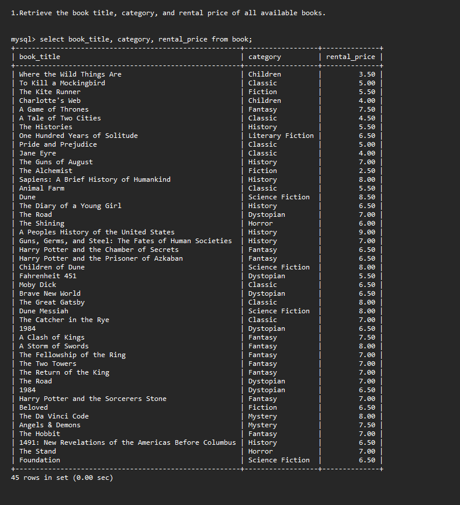 &nbsp;

---

### Q2. List the employee names and their respective salaries in descending order of salary. 

Query:
mysql> select ename, salary from employee order by salary desc;

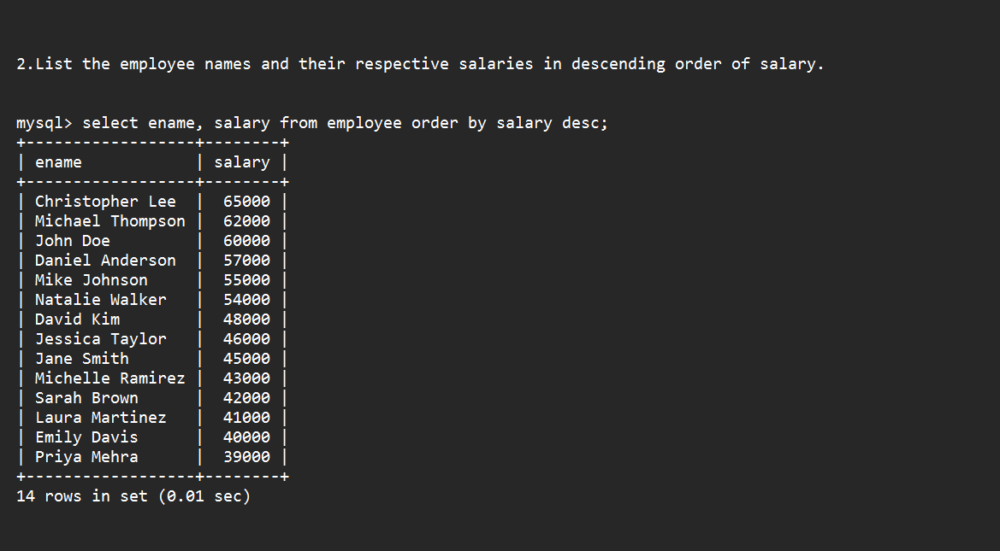 &nbsp;

---

### Q3. Retrieve the book titles and the corresponding customers who have issued those books.

Query:
mysql> select b.book_title, m.member_name from issue_status i join book b on i.issued_book_isbn = b.isbn join member m on i.issued_member_id = m.member_id;

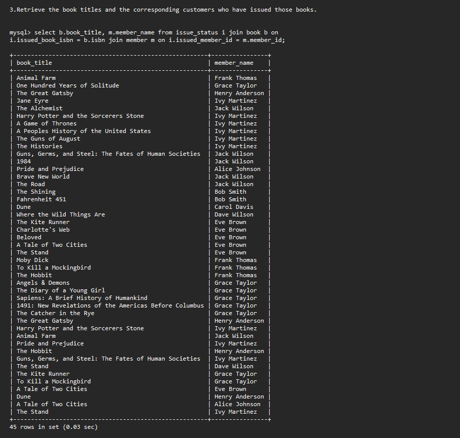 &nbsp;

---

### Q4. Display the total count of books in each category.

Query:
mysql> select category, count(*) from book group by category;

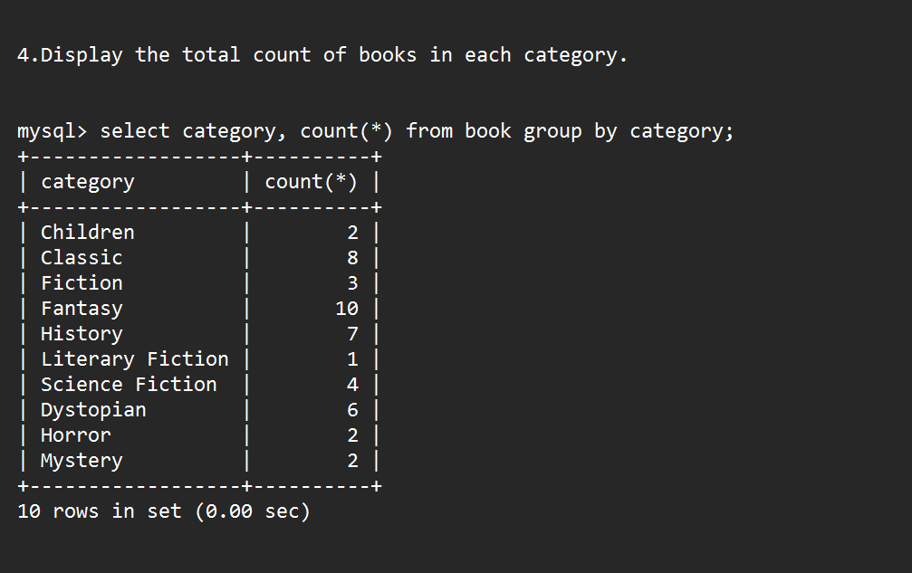 &nbsp;

---

### Q5. Retrieve the employee names and their positions for the employees whose salaries are above Rs.50,000.

Query:
mysql> select ename, position, salary from employee where salary > 50000;

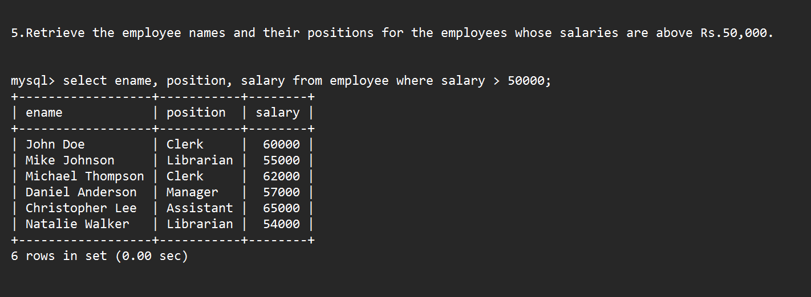 &nbsp;

---

### Q6. List the customer names who registered before 2022-01-01 and have not issued any books yet.

Query:
mysql> select member_name, reg_date from member m left join issue_status i on m.member_id = i.issued_member_id where reg_date < '2022-01-01' and issued_id is null;

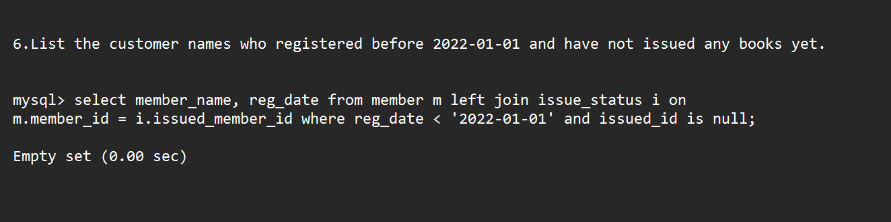 &nbsp;

---

### Q7. Display the branch numbers and the total count of employees in each branch.

Query:
mysql> select b.branch_id, count(e.emp_id) from branch b join employee e on b.branch_id = e.branch_id group by b.branch_id;

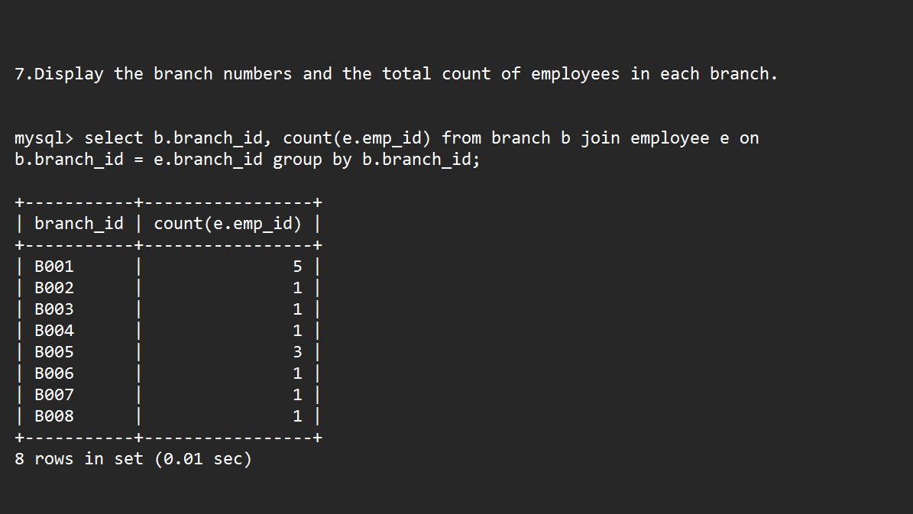 &nbsp;

---

### Q8. Display the names of customers who have issued books in the month of April 2024.

Query:
mysql> select m.member_name, b.book_title, i.issued_date from member m join issue_status i on m.member_id = i.issued_member_id join book b on i.issued_book_isbn = b.isbn where monthname(i.issued_date) = 'APRIL' and year(i.issued_date) = 2024;

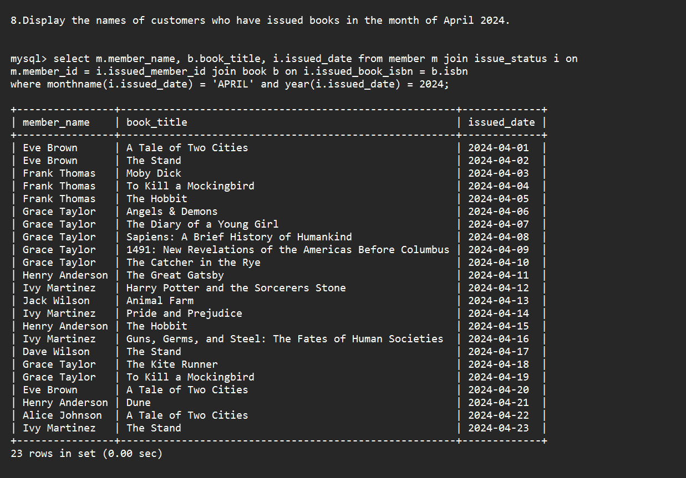 &nbsp;

---

### Q9. Retrieve book titles from the book table containing the category "history".

Query:
mysql> select isbn, book_title, category from book where category = 'History';

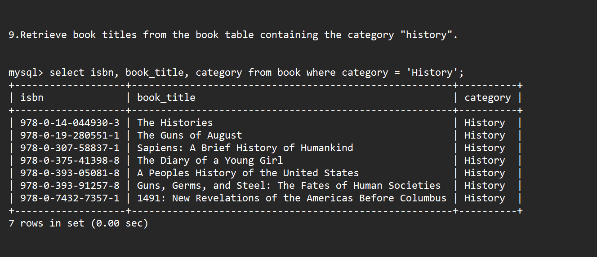 &nbsp;

---

### Q10. Retrieve the branch numbers along with the count of employees for branches having more than 2 employees.

Query:
mysql> select b.branch_id, count(e.ename) as Number_Of_Employees from branch b join employee e on b.branch_id = e.branch_id group by b.branch_id having count(*) > 2;

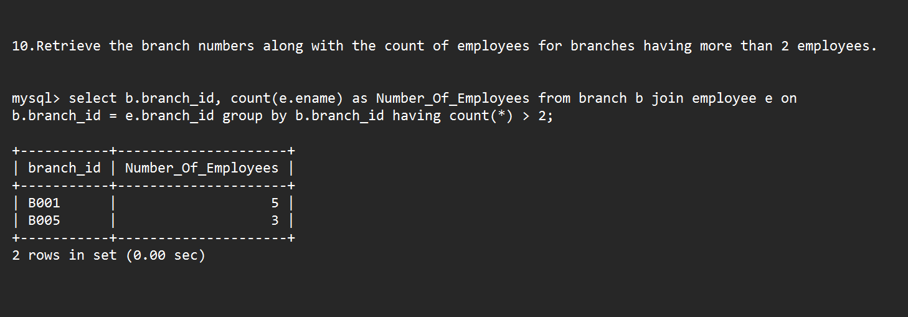 &nbsp;

---

### Q11. List all books that have never been issued.

Query:
mysql> select b.book_title, i.issued_book_isbn from book b left join issue_status i on b.isbn = i.issued_book_isbn where i.issued_book_isbn is null;

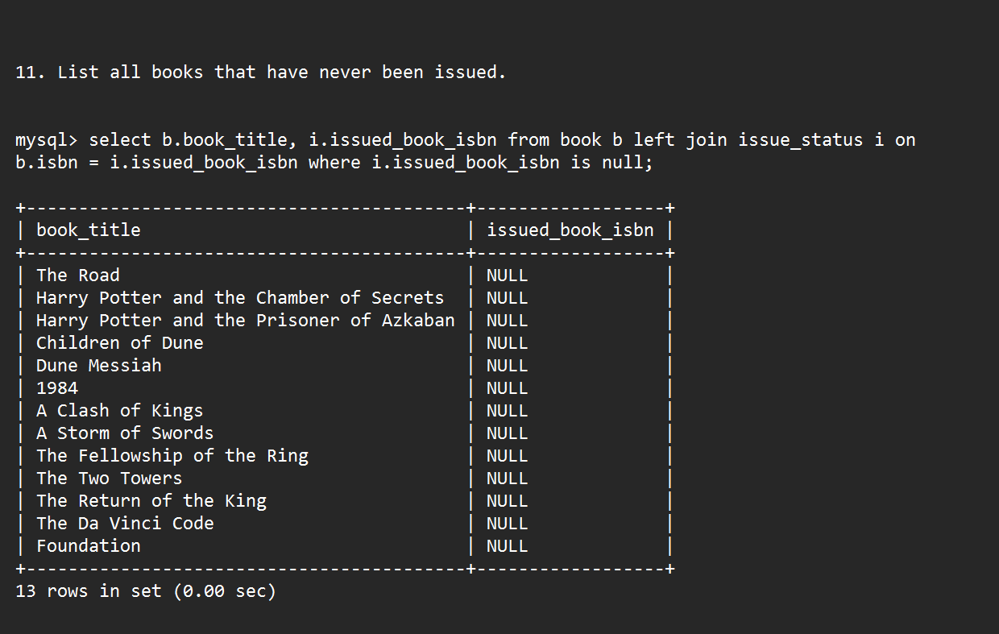 &nbsp;

---

### Q12. Find the total number of members registered in the system.

Query:
mysql> select count(*) from member where reg_date is not null;

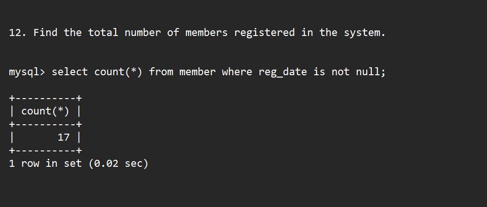 &nbsp;

---

### Q13. Show all books issued by employee E106.

Query:
mysql> select b.isbn, b.book_title, i.issued_emp_id from book b join issue_status i on b.isbn = i.issued_book_isbn where i.issued_emp_id = 'E106';

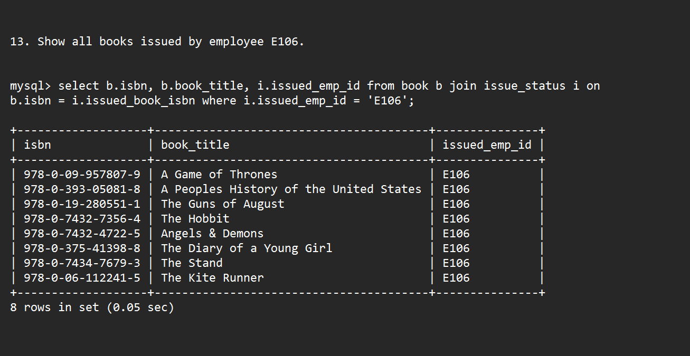 &nbsp;

---

### Q14. Display the list of books returned in the month of May 2024.

Query:
mysql> select return_book_title, monthname(return_date), year(return_date) from return_status where monthname(return_date) = 'May' and year(return_date) = 2024;

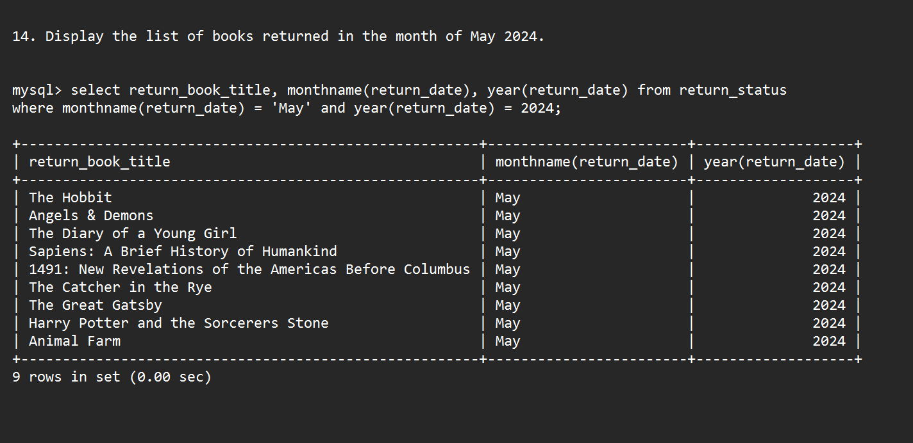 &nbsp;

---

### Q15. Count how many books each member has issued.

Query:
mysql> select issued_member_id, count(*) as Number_Of_Books_Issued from issue_status group by issued_member_id;

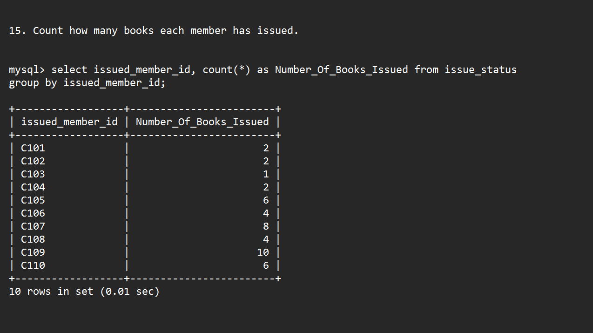 &nbsp;

---

### Q16. Show the details of members who have never issued any book.

Query:
mysql> select * from member where member_id not in (select distinct issued_member_id from issue_status);

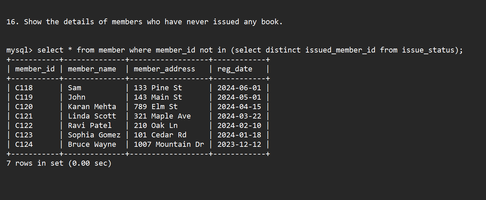 &nbsp;

---

### Q17. Find the earliest and latest book issue date in the system.

Query:
mysql> select min(issued_date) as Earliest_Issued_Date, max(issued_date) as Latest_Issued_Date from issue_status;

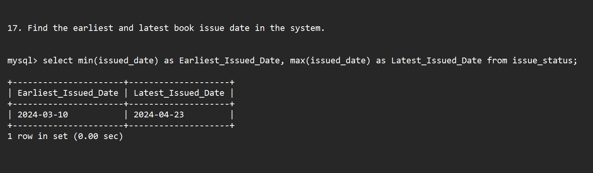 &nbsp;

---

### Q18. Get the names of employees who issued books to member C109.

Query:
mysql> select emp_id, ename from employee where emp_id in (select issued_emp_id from issue_status where issued_member_id = 'C109');

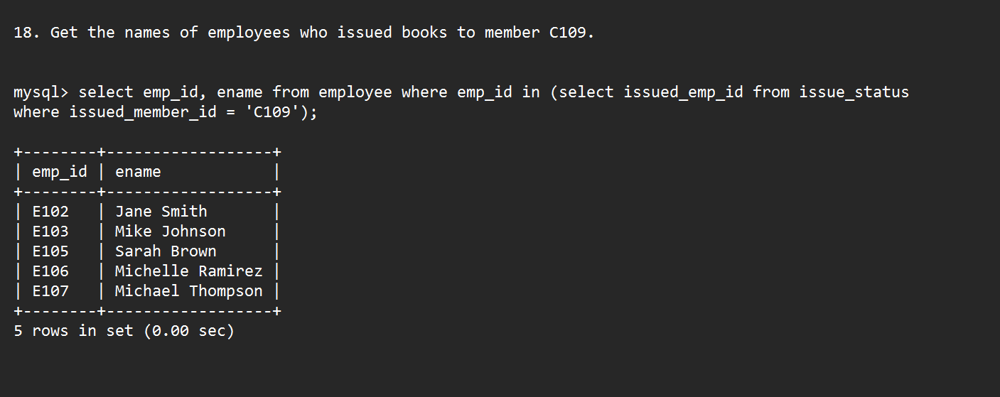 &nbsp;

---

### Q19. Display all books that have been returned along with their return dates.

Query:
mysql> select return_book_title, dayname(return_date), monthname(return_date), year(return_date) from return_status;

 &nbsp;

---

### Q20. Get the top 5 most recently issued books.

Query:
mysql> select issued_book_title, issued_date from issue_status order by issued_date desc limit 5;

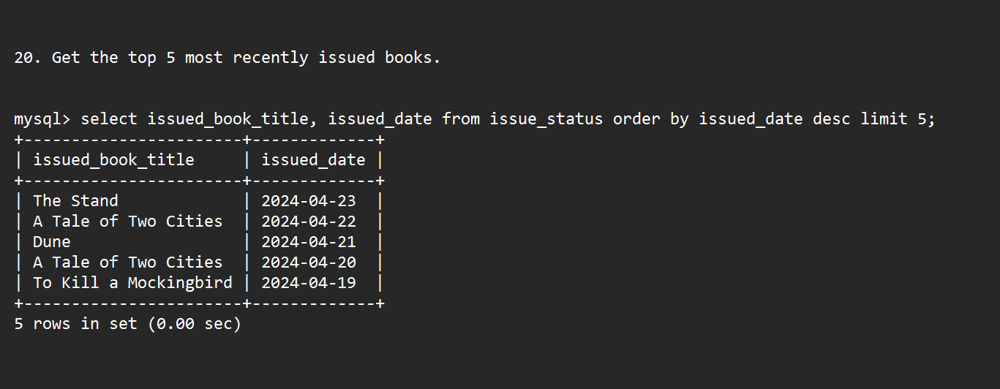 &nbsp;

---

### Q21. List the number of books issued by each employee.

Query:
mysql> select e.emp_id, e.ename, count(i.issued_book_title) from employee e join issue_status i on e.emp_id = i.issued_emp_id group by i.issued_emp_id order by e.emp_id;

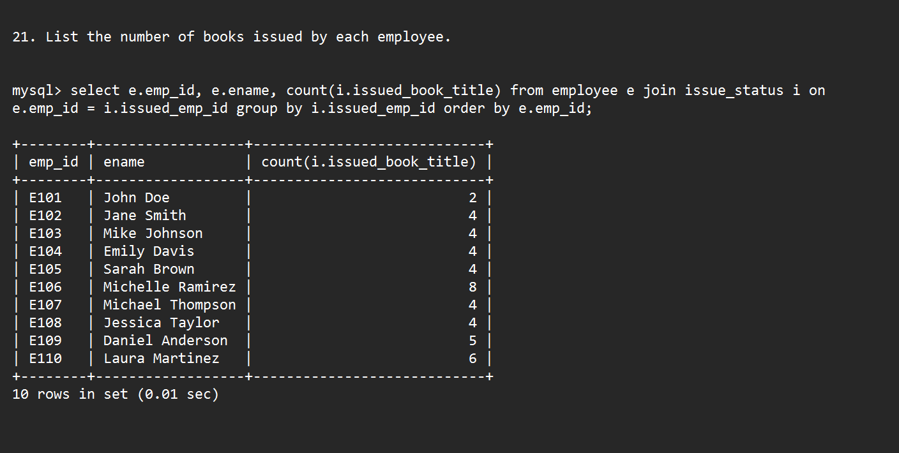 &nbsp;

---

### Q22. Show members who have returned all the books they issued.

Query:
mysql> select m.member_id, m.member_name from member m join issue_status i on m.member_id = i.issued_member_id group by m.member_id having count(i.issued_id) = (select count(r.return_id) from return_status r where r.issued_id in (select issued_id from issue_status where issued_member_id = m.member_id));

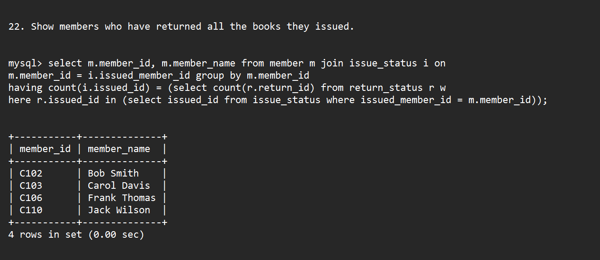 &nbsp;

---

### Q23. For each book, show how many times it has been issued.

Query:
mysql> select b.isbn, b.book_title, count(i.issued_book_isbn) from book b join issue_status i on b.isbn = i.issued_book_isbn group by b.isbn, b.book_title;

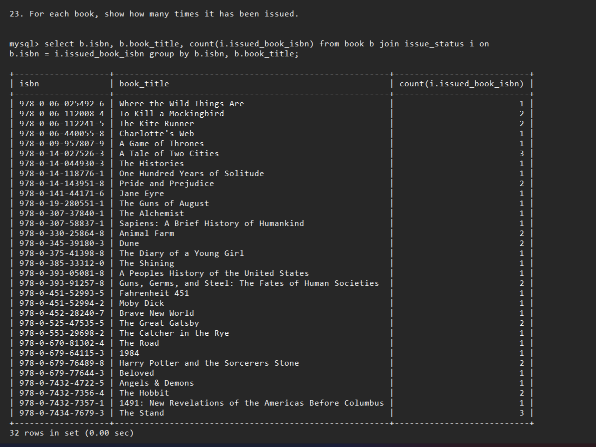 &nbsp;

---

### Q24. Find the most active member (who issued the most books).

Query:
mysql> select m.member_id, m.member_name, count(i.issued_id) as Issued_books_Count from issue_status i join member m on i.issued_member_id = m.member_id group by i.issued_member_id order by count(i.issued_id) desc limit 1;

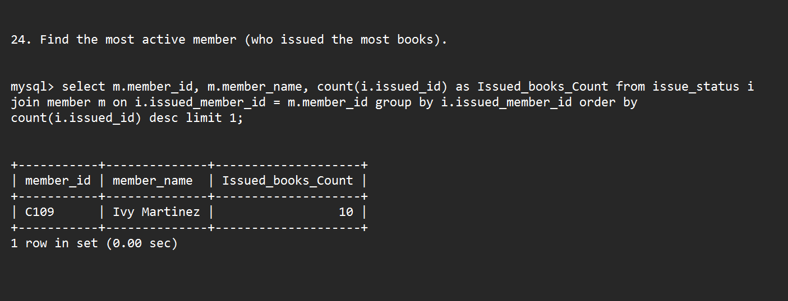 &nbsp;

---

### Q25. Display books that have been issued multiple times to the same member.

Query:
mysql> select issued_member_id, issued_book_isbn, count(issued_book_title) as Number_Of_Times_Book_Issued from issue_status group by issued_member_id, issued_book_isbn having count(issued_book_title) > 1;

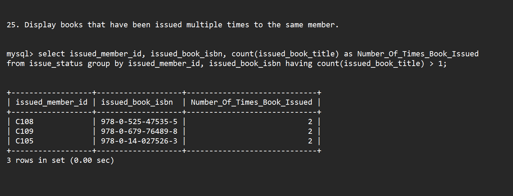 &nbsp;

---

### Q26. Label books as Returned, Not Returned.

Query:
mysql> select i.issued_id, r.return_id, i.issued_book_title, case when r.return_id is not null then 'Returned' else 'Not Returned' end as Return_Status from issue_status i left join return_status r on i.issued_id = r.issued_id;

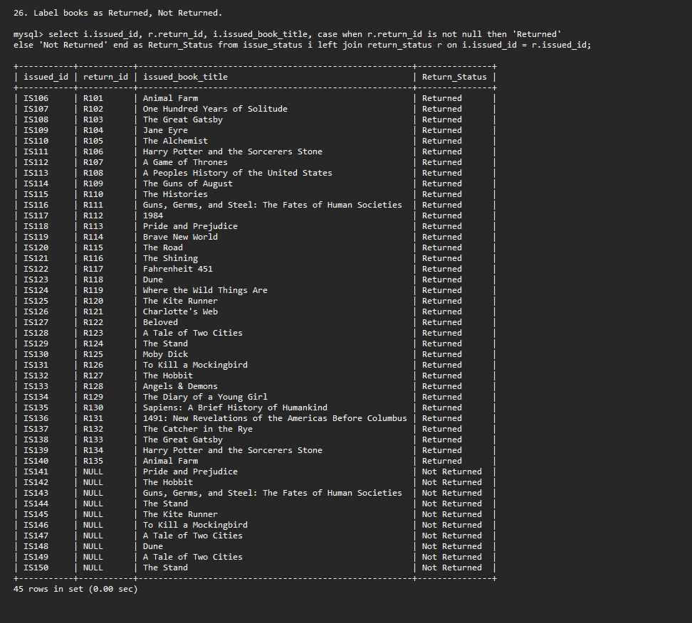 &nbsp;

---

### Q27. Use DENSE_RANK() to rank members based on number of books issued.

Query:
mysql> select i.issued_member_id, m.member_name, count(*) as Books_Issued, dense_rank() over(order by count(*) desc) as Ranking from issue_status i join member m on i.issued_member_id = m.member_id group by issued_member_id;

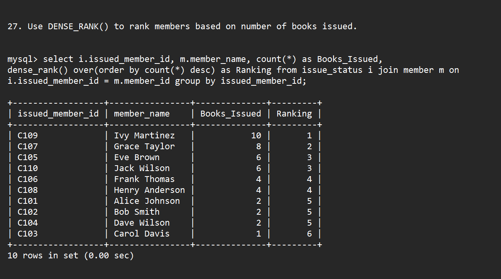 &nbsp;

---

### Q28. Use PARTITION BY to show issue count per member with a running total.

Query:
mysql> select i.issued_member_id, i.issued_id, m.member_name, count(*) over(partition by i.issued_member_id) as Total_Issued_Books, count(*) over(partition by i.issued_member_id order by i.issued_id) as Running_Total from issue_status i join member m on i.issued_member_id = m.member_id;

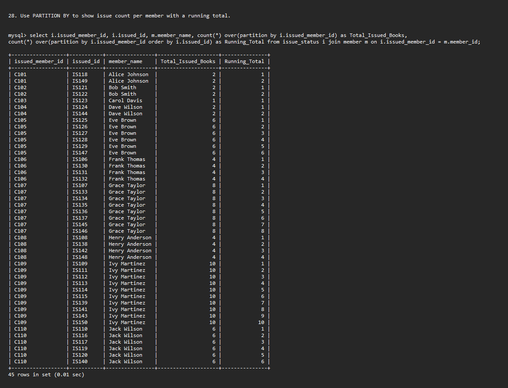 &nbsp;

---

### Q29. List members who returned books within 7 days of issue.

Query:
mysql> select m.member_id, m.member_name, i.issued_date, r.return_date from member m join issue_status i on m.member_id = i.issued_member_id join return_status r on i.issued_id = r.issued_id where datediff(r.return_date, i.issued_date) <= 7;

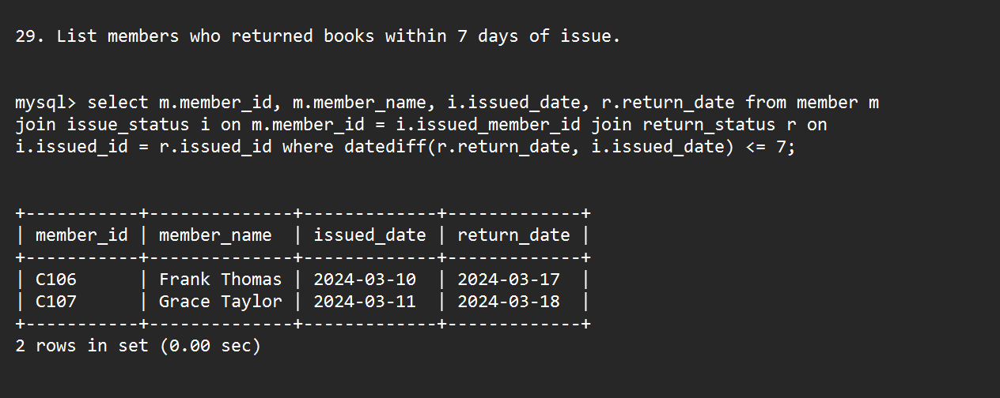 &nbsp;

---

### Q30. Calculate the average time between issue and return for each member.

Query:
mysql> select distinct i.issued_member_id, m.member_name, avg(datediff(r.return_date, i.issued_date)) over(partition by i.issued_member_id) as Average_Book_Return_Time from issue_status i join return_status r on i.issued_id = r.issued_id join member m on i.issued_member_id = m.member_id;

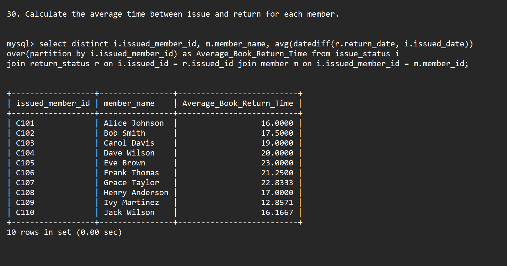 &nbsp;

---

## Working of the System

- Each branch operates with assigned employees and manages books locally.
- Members can borrow (issue) books, recorded in the Issue_Status table.
- Returned books are tracked in the Return_Status table.
- Employees handle issuing/returning activities, maintaining accountability.
- Availability (status) is manually updated after transactions (no triggers used).

---

## Advantages

-Organized and relational structure for efficient management.
- Demonstrates understanding of foreign keys, joins, and referential integrity.
- Suitable for students learning SQL through a real-world library model.

---

## Limitations

- Manual book status updates may lead to errors.
- Does not support automated fine calculation for late returns.
- No GUI interface — command-line operation only.

---

## Future Scope

- Add triggers for automatic update of book status upon issue/return.
- Implement fine calculation for overdue books.
- Introduce stored procedures for bulk member or book operations.
- Build a web or GUI-based interface for easier usage.

---

## Conclusion

The Library Management System Database is a comprehensive SQL project that illustrates key database concepts in a real-world context.
It efficiently models library operations such as book issuance, returns, and inventory tracking while providing strong insights into relational data handling and SQL querying.
